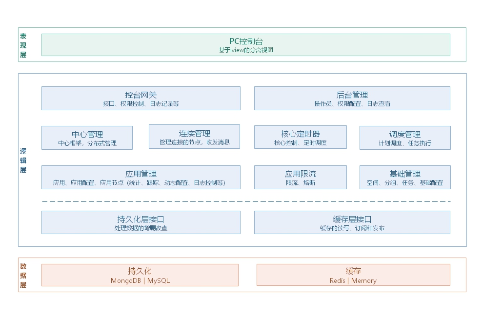
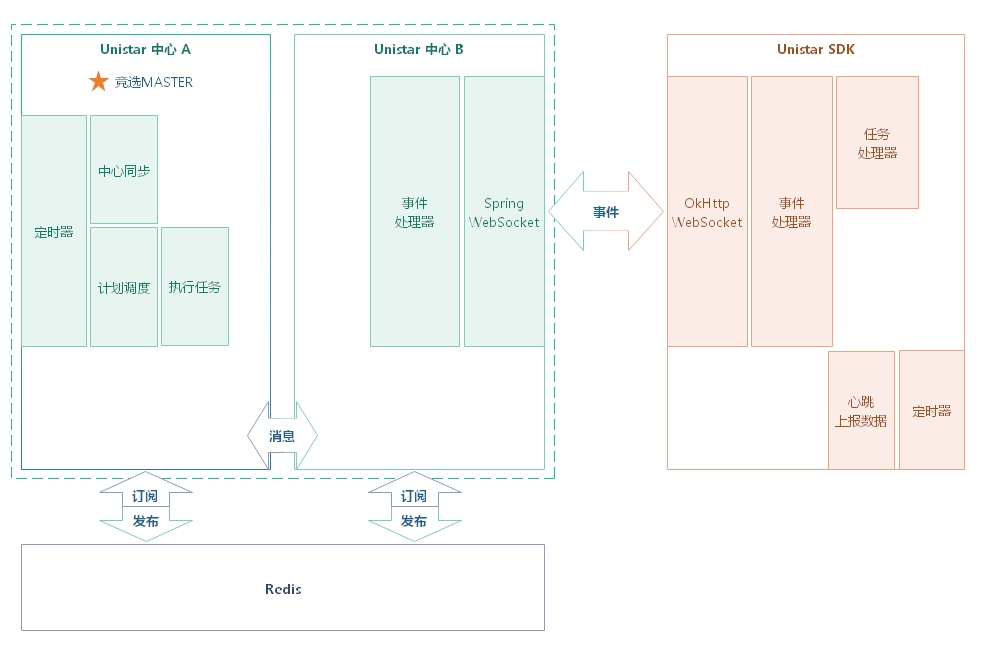
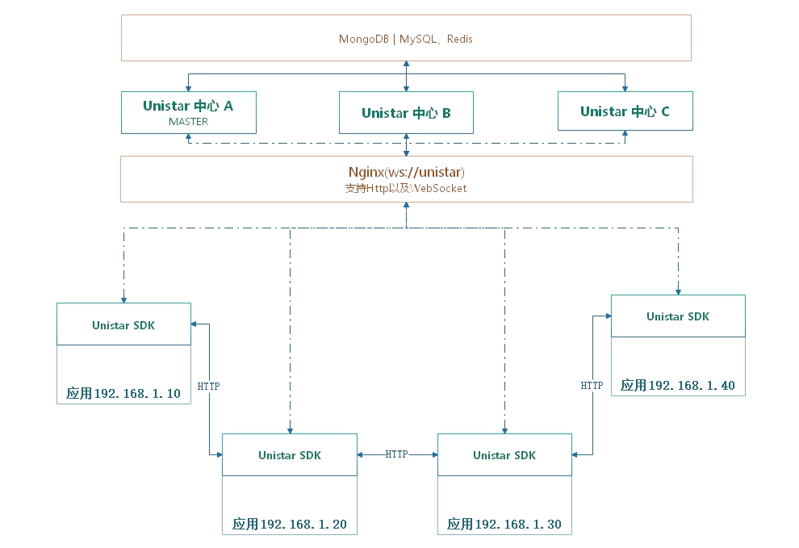

# Unistar

### Unistar介绍

Unistar即Union-Star，寓意为将按照星辰连接的方式来连接系统，通过统一的规则来构建诸天万界。

Unistar是一个整合型的微服务架构体系，提倡的是最小化原则，相比市面上谈微服务色变，Unistar仅通过一个核心中心和一个SDK，就能够享受一系列功能，让开发者瞬间拥有快速构建微服务体系的能力。

Unistar基于SpringCloud构建的微服务中心，除了支持SpringCloud的注册模式，还支持手动录入模式。

Unistar不仅仅是一个微服务中心，还支持配置中心、任务调度、请求统计，链路追踪、限流熔断、日志打印控制。

Unistar不仅仅是一个微服务中心，更是一种微的理念。

### Unistar整体架构

- 整体架构图

    
- 逻辑结构图

- 运维拓扑图

### Unistar项目介绍

Unistar项目由一个总项目+三个子项目组成，总项目定义整体的Maven依赖，确保版本的一致性。

- xc-unistar

  - xc-unistar-common
    
    common包的主要作用是定义central服务与springcloud的sdk包之间的公有对象
    
  - xc-unistar-central
  
    central为unistar的中心服务，通过配置后可启动作为微服务体系的中心，支持动态多中心分布式，通过自定义的选取方式，可以随时动态增添中心服务
  
  - xc-unistar-springcloud
  
    该sdk包提供了基于SpringCloud的配置获取、服务注册发现等功能的unistar具体实现，项目通过引入该sdk包既可以快速接入unistar中心
  
### Unistar项目的使用

参考 [Unistar中心(xc-unistar-central)](./xc-unistar-central) 文档
  
  
